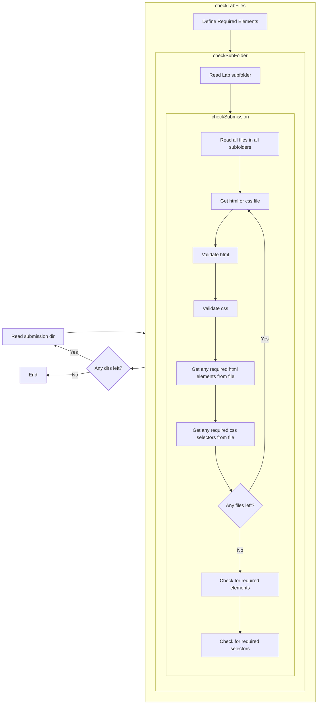

# Grading Assistant for CIS 195

Dependency graph for TestLab5.js

```mermaid
flowchart RL
 M1[Read submission dir] --> checkLabFiles
checkLabFiles -->M2{Any dirs left?}
    M2 -->|Yes| M1
    M2 -->|No| M3[End]   
    
subgraph checkLabFiles
A[Define Required Elements]-->checkSubFolder
end

subgraph checkSubFolder
B[Read Lab subfolder]-->checkSubmission
end

subgraph checkSubmission
C[Read all files in all subfolders] --> C1
C1[Get html or css file] --> C2[Validate html]
C2 --> C3[Validate css]
C3 --> C4[Get any required html elements from file]
C4 --> C5[Get any required css selectors from file]
C5 --> C10{Any files left?}
C10 -->|Yes| C1
C10 --> |No| C11
C11[Check for required elements] --> C12[Check for required selectors]
end
    
```

