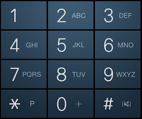

# Lab 3, Part 1: Selection Exercises

Create a file named `Lab03_Part1.js` For each problem, put the solution in a function in that file. You have been provided with an HTML file, [CS133JS_Lab03_Part1.html](https://lcc-cit.github.io/CS133JS-CourseMaterials/Labs/Lab03/CS133JS_Lab03_Part1.html), you will replace the `TODO:` comments with code to call the function you wrote and display the results on the web page.

## Problems:

1. Check for A+ &mdash;using a simple if statement
  - Write a function named `checkForAPlus` that does the following:
     - Has a parameter for an exam score.
     - If the score is above 97, return "A+".
   - In the .html file, call the function twice, first with a "hard coded" argument of 97 and then 98. Show results of both on the web page. The easiest way to show the results is to use `document.write`.
  
3. Check for A+, A, A- &mdash;a multi-branching if statement

   - Write a function named `checkForAnyA` that does the following:
     - Has a parameter for an exam score.
     - For each range, return the correct grade to the console:
       - 98 to 100: "A+"
       - 93 to 97: "A"
       - 90 to 92: "A-"
       - Anything else: "Ungraded"
   - In the .html file, call the function multiple times using "hard coded" numbers that will give you each possible result. Show results on the web page.
   
4. Letter to GPA conversion&mdash;a multi-branching if statement.

   - Write a function named `gpaConversion` with one parameter for a letter grade that does the following:
     - For each letter, return the correct number grade:
       - "A+": 4.33
       - "A": 4.0
       - "A-": 3.67
       - Anything else: "Out of range"
   - In the .html file, call the function just enough times, using "hard coded" numbers, so that you get each possible result once. Put the results on the web page.
   
3. Check file upload&mdash;a logical operation using OR
(You won't really upload files, this is just code that would check the file type.)
   - Write a function named `checkFileType` to check *file extensions* to see if they are for a type allowed to be uploaded.
     - Use a single parameter to hold a file extension (that's the part of the file name after the dot.)
     - If the extension is either .doc, .docx, or .pdf, return "Accepted" to the console
     - Otherwise return "Wrong type".
   - In the .html file, call the function just enough times, using "hard coded" strings, so that you get each possible result once. Show the results on the web page.

6. Two-factor authentication&mdash;using the AND logical operator
   (You won't really do authentication, you'll just write code to check hypothetical login credentials.)
   
   - Write a function named `authenticate`  that checks credentials for logging into a computer.
     - Use two parameters:
       - one to hold a user name (a string)
       - one to hold  a PIN (a number)
     - In the function body:
       - Declare and initialize constants to with a "hard coded" username and  PIN.
       - Check the values passed into the function. If both credentials match the values stored in the constants, return "authenticated", otherwise return "access denied".
   - In the .html file, call the function just enough times, using "hard coded" values, so that you get each possible result once. Show the results on the web page.
   
5. Determine kindergarten admission&mdash;a logical operation using AND
  - Write a function named `canStartKindergarten` that determines whether a child can start kindergarten.
    - Use parameters to hold a child's age (a number) and whether their birthday was before August 1st (boolean).
    - return "Start kindergarten"  if they are either:
       - Five years old, and their birthday was before August 1st, 
       - Or six years old and their birthday was after August 1st,
    - Otherwise log either "Too young", or "Too old", depending on their age.
    
  - In the .html file, call the function just enough times, using "hard coded" values, so that you get each possible result once. Show the results on the web page.
  
8. Convert Roman numerals to decimal numbers&mdash;using switch case
   - Write a function named `romanToDecimal` to convert Roman numerals I through V to decimal numbers.
     - Use a parameter to hold a Roman numeral.
     - For each case in the switch statement select the correct decimal number.
     - The default case should be "out of range" for numbers that are too big, or too small (zero or negative).
   - In the .html file, call the function just enough times, using "hard coded" values, so that you get each possible result once. Show the results on the web page.
   
9. Phone dial pad letters&mdash;using switch case
   - Write a function named convertDialPad to convert the top row of a phone dial pad to numbers. Here's what a typical dial pad looks like:
     
      
     
     These are the values that are equivalent: 
     
     - 1 = 1.
     - A, B, or C = 2.
     - D, E, or F = 3.
     
   - The function will have one parameter holding a dial pad letter or number. 
   
   - The code in the function body will use a switch statement get the correct  number.
   
   - If the input doesn't match, the default case should be "Not valid".
   
   - In the .html file, call the function just enough times, using "hard coded" values, so that you get each possible result once. Show the results on the web page.

------

 Beginning JavaScript lab assignments by [Brian Bird](https://profbird.dev), 2018, revised <time>2023</time> are licensed under a [Creative Commons Attribution-ShareAlike 4.0 International License](http://creativecommons.org/licenses/by-sa/4.0/). 