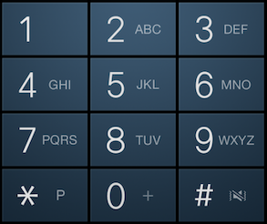

# Lab 2, Part 1: Selection Exercises

For each problem, type the solution code in the console and execute it. Don't clear the console, since you will be copying everything into a document which you will submit on Moodle.

1. Check for A+ &mdash;a simple if statement
  - Write the code to do the following:
     - Get an exam score.
     - If the score is above 97, log "A+" to the console.
   - Execute the code using 97 and 98 as input.
3. Check for A+, A, A- &mdash;a multi-branching if statement

   - Write the code to do the following:
     - Get an exam score.
     - For each range, log the correct grade to the console:
       - 98 to 100: "A+"
       - 93 to 97: "A"
       - 90 to 92: "A-"
       - Anything else: "Ungraded"
   - Execute the code using numbers that will give you each possible result.
   
4. Letter to GPA conversion&mdash;a multi-branching if statement.

   - Write the code to do the following:
     - Get a letter grade.
     - For each letter, log the number grade to the console:
       - "A+": 4.33
       - "A": 4.0
       - "A-": 3.67
       - Anything else: "Out of range"
   - Execute the code using numbers that will give you each possible result.
   
3. Check file upload&mdash;a logical operation using OR

   - Write code to check file types to see if they are the type allowed for an upload.
     - Get a file extension (that's the part of the file name after the dot.)
     - If the extension is either .doc, .docx, or .pdf, log "Accepted" to the console
     - Otherwise log "Wrong type".
   - Execute the code using input that will test all the possibilities.

4. Two-factor authentication&mdash;a logical operation using AND

   - Write code to check credentials for logging into a computer
     - Get a password (as string) and a PIN (a number)
     - If both credentials match, log "authenticated" to the console.
     - Otherwise log "access denied".
   - Execute the code using input that will test all the possibilities.

5. Determine kindergarten admission&mdash;a logical operation using AND
  - Write code to see if a child can start kindergarten.
    - Get the child's age and whether their birthday was before August 1st (true or false).
    - If they are five, and their birthday was before August 1st, log "Start kindergarten" to the console.
    - Otherwise log either "Too young", or "Too old".
    
       (Take the birthday into account as well as the age.)
    
  - Execute the code using input that will test all the possibilities.
8. Convert Roman numerals to decimal numbers&mdash;switch case
   - Write code to convert Roman numerals I through V to decimal numbers.
     - Get the Roman numeral.
     - For each case in the switch statement log the correct decimal number to the console.
     - Log "out of range" for numbers that are too big.
   - Execute the code using input that will test all the possibilities.
9. Phone dial pad letters&mdash;switch case
   - Write code to convert the top row of a phone dial pad to numbers. Here's what a typical dial pad looks like:
     
      
     
     These are the values that are equivalent: 
     
     - 1 = 1.
     - A, B, or C = 2.
     - D, E, or F = 3.
     
   - This is what your code will do:
   
     - Get the letter or number.
     - For each case in the switch statement log the correct  number to the console.
     - If the input doesn't match log "Not valid" to the console.
   
   - Execute the code using input that will test all the possibilities.