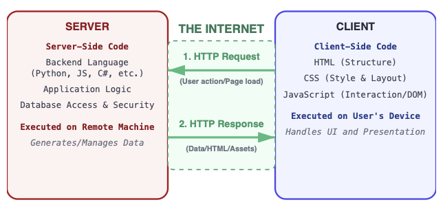

<h1>Intro to the Course and to JavaScript</h1>

**CS133JS Beginning Programming: JavaScript**

| Topics by Week                                           |                                    |
| -------------------------------------------------------- | ---------------------------------- |
| 1. <mark>Intro to JavaScript programming</mark>          | 6. Arrays                          |
| 2.  Functions, Variable scope, Operators and Expressions | 7. Objects and Object Constructors |
| 3. Conditional Statements: if and switch                 | 8. Web Page I/O                    |
| 4. Repetition: while, do while, and for                  | 9. Review                          |
| 5. Midterm                                               | 10. Final                          |


<h2>Table of Contents</h2>

[TOC]

## Introduction

### About Me

- Why I like to create software
- Professional history
- What I teach
- LCC's Software Development degree

### Course Prerequisites

You need to know a little bit of HTML which is taught in CIS 195, Web Authoring, and which can be taken at the same time as this course. These are the specific parts of HTML you will need to know:

- HTML elements and tags
- Attributes (key-value pairs inside the opening tag of a element)
- Headings
- Paragraphs
- Block quotes
- Links (`<a>` elements)
- Images
- Iframes
- Forms and input elements  

A good way to review these topics or to get a head-start on them if you are currently taking CIS 195 is by doing the tutorials at [W3Schools](https://www.w3schools.com/html/default.asp).

## Static pages vs. dynamic (interactive) pages

### Examples

- [Facebook](https://www.facebook.com/) all dynamic (likes, comments, add friend, etc.)
- [LTD](https://www.ltd.org/) static pages (about us) and dynamic (trip planner)

### Exercise

- [LCC](https://www.lanecc.edu/) web site – which parts are interactive?


​       			

## Server-side vs. client side code

- Server-side code vs. client side (browser) code
   
- What needs to happen on the server?  
  - Storing data
  - Interaction with other users
  - Member information
  - Heavy processing tasks
- What can be done in the client?
  - Light-weight processing, examples:
    - Temperature and unit conversion
    - Time zone conversion
    - Single player games
  - Check user input before storing it
  - Animations
### Examples

Revisit these and discuss what might run on the server and what might run in the browser.

- [Facebook](https://www.facebook.com/) (likes, comments, add friend, etc.)
- [LTD](https://www.ltd.org/) static pages (about us) and dynamic (trip planner)

### Exercise

[LCC](https://www.lanecc.edu/) web site – which parts could run on the server? Which parts in the browser?


## Intro to JavaScript 

- Provides interactivity using client-side code.
  
  - Originally designed to just run in web browsers (client-side code) but now used everywhere including: server-side, desktop, and mobile thanks to *Node.js*.
  
- A completely different language from Java, but has some similarities

  - JS is interpreted, dynamically typed, and multi-paradigm (procedural & Object Oriented, imperative & functional). *We’ll explain these things later.*

  ### Guided Exercise: Hello world

  1. Set up your computer to do JavaScript development.
     - Install [Chrome](https://www.google.com/chrome/dr/download) if it isn't already installed on your computer.
  2. Open Chrome, press F12, and select console. We'll put this code in the console.
     (Almost any browser will have a similar feature in it's *developer* menu)
  3. Enter the code below. (This is simple, but not very useful.) 
  ```javascript
  document.write("<p>Hello world!</p>");
  ```
  3. Lets add a *variable* named `name`. A variable is a thing we can use to store information. Now you'll be able to change the name, but you'll need to change the code to do it  :-(
  ```javascript
   var name = "world"; // can change to “other names”
   		 document.write("<p>Hello " + name + "!</p>");
  ```

4. Finally, we'll add a way for a user to enter information. We do that by adding code that prompts the user for input.
  ```javascript
  var name = prompt("Please enter your name");
  	document.write("<p>Hello " + name + "!</p>");
  ```
  Now it's almost useful :-)

Let's talk about how this works by looking at some key pieces of the code:

- `var`
  We use this JavaScript keyword to *declare* a variable. Declaring a variable means announcing to JavaScript that this is a new variable that we will be using. 
  (Later we'll learn to use `let` to declare variables).
- `prompt`
  A function built into JavaScript that pops up a dialog box that displays a message on the web page and lets the user enter some input.
- `=`
  The *assignment operator*. It takes the information (in this case a name) coming from the prompt on the right and puts it into the variable on the left.  
  **Note**: in computer programming, the direction information flows with the `=` symbol, right to left, is the opposite of algebra.

## Course Tour

- Syllabus – quick overview

- Reading and Quizzes
  
  - Purpose of quizzes isn’t testing, it’s focus and accountability.
  
- Lab assignments
  - Part 1 will usually be a set of practice exercises.
  - Part 2 will require problem-solving.
    - What is problem solving? 
    - Why is it important?
  - You will upload your solutions to Moodle and usually to citstudent as well.
  
- Code reviews
  - Each lab assignment has a beta and production version. Code reviews are done on the beta version.
  - One reason we do code reviews: they are used by development teams in the real world.
  - You will be assigned two lab partners
    - Let me know if you have a preference for a lab partner
    - Lab partners will each be doing a different version of each lab assignment.
  
  - Look at the code review guide (there's a link in the Moodle page fly-out).
  
  
   	

## Reference

[JavaScript Reserved Words](https://www.w3schools.com/js/js_reserved.asp)&mdash;W3Schools

The *reserved words* are the "vocabulary" of JavaScript.


------

[](http://creativecommons.org/licenses/by-sa/4.0/) Beginning JavaScript Lecture Notes by [Brian Bird](https://profbird.dev), written in 2018, revised in <time>2025</time>, are licensed under a [Creative Commons Attribution-ShareAlike 4.0 International License](http://creativecommons.org/licenses/by-sa/4.0/). 

------------